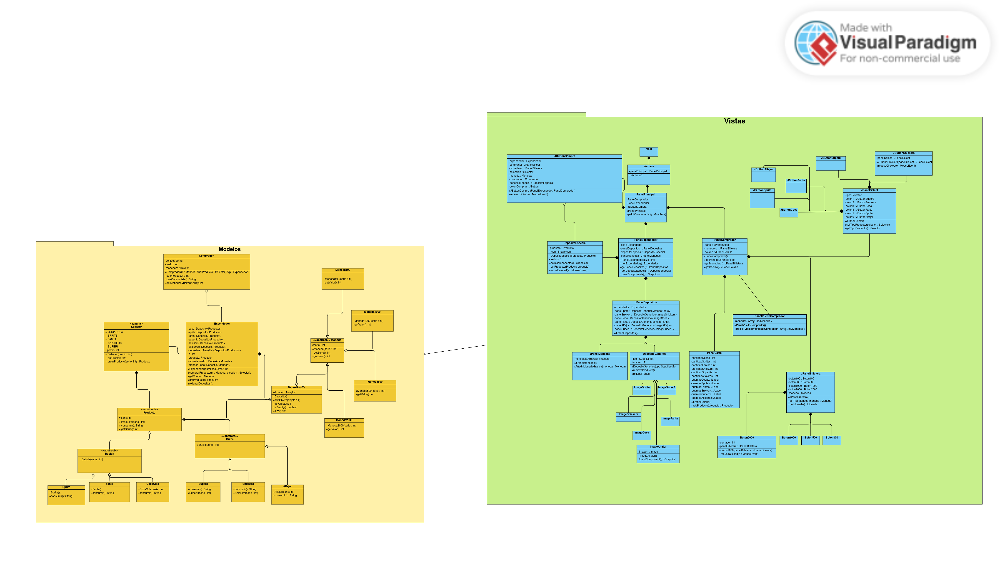
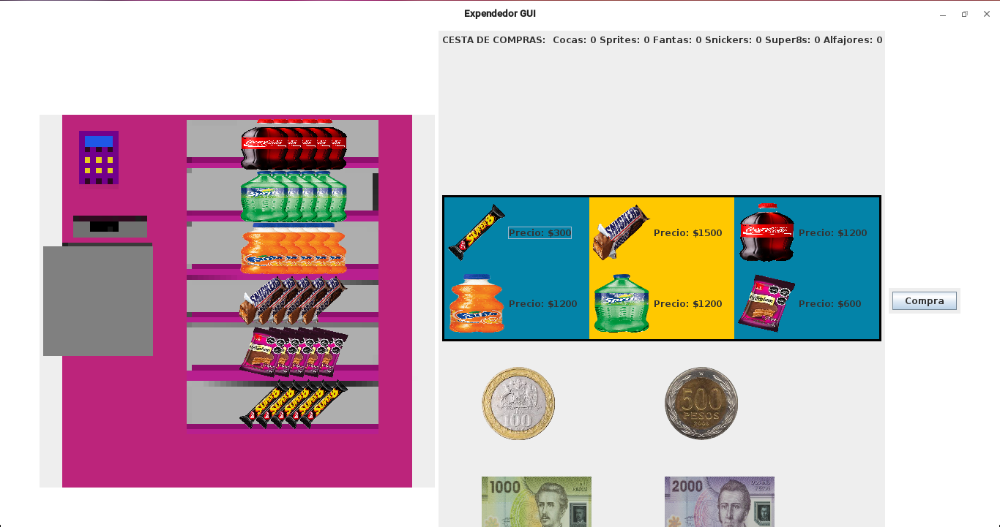

# Tarea 3 Desarrollo Orientado a Objetos
### Integrantes: 
 - Gabriel Sebastián Castillo Castillo
 - Marcos Emiliano Martínez Rojas

### Instrucciones de uso:
Una vez teniendo clonado el repositorio: 
 - Ejecutar el Main que se encuentra en el package "vistas".
 - Una vez abierta la ventana, podrá seleccionar un producto y una moneda del panel del comprador (derecha).
 - Seleccionar el botón de "Comprar" para realizar la compra.
 - Si no tiene suficiente dinero, se le notificará con un mensaje. Además se le devolverá la moneda.
 - Si no hay stock del producto, se le notificará con un mensaje. Además se le devolverá la moneda.
 - Si la compra fue exitosa, aparecerá el producto en el deposito del Expendedor. Usted podrá posar el cursor sobre el producto para ver su numero de serie y hacerle click.
 - Si usted presiona sobre el panel del Expendedor (izquierda) podrá rellenar los depósitos de los productos.

### Diagrama UML:
Tanto las clases JButton[Producto] como las clases Image[Producto] y las clases Boton[numero], solo se especifica una sola clase, ya que el resto de su familia de clases las replica.
Lo único que las diferencia es la imagen que cada clase carga. 

### Interfaz de usuario: 

### Cambios realizados:
 - Se agregó un producto extra (Alfajor), únicamente con el propósito de que fuera una grilla de productos de 2x3.
 - Se agregó un método en Expendedor para que pueda rellenar sus depósitos.
 - Se creó un enum más sofisticado, él cual además, pueda crear productos. 
 - Se cambió Moneda1500 por Moneda2000, únicamente con el motivo de la imagen de un billete de $2000.
